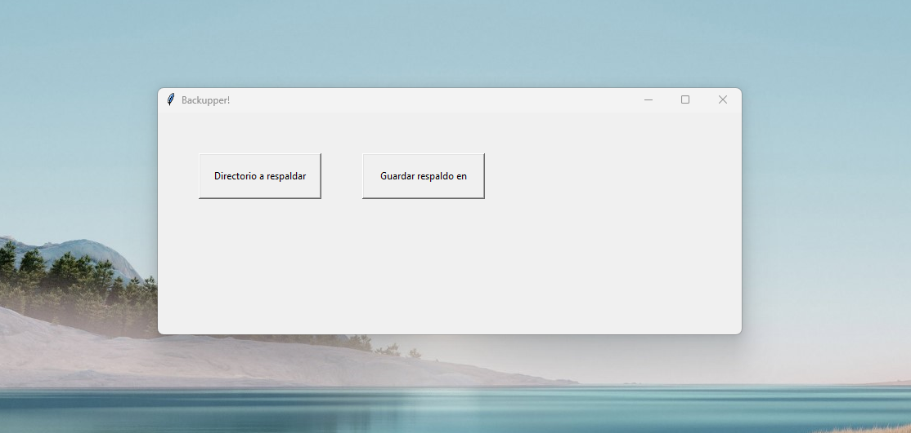

# BackUpper!

Files backup software made with Python.



## Maintainer <admodevops@proton.me>

#### Build Instructions

First, install the needed packages in your environment:

```bash
pip install -r requirements.txt
```

Then, with the package manager of your OS/Distro install the package python3-tk or python3.10-tk.

To compile the code, please, position yourself on the root directory and run the following command:

```bash
pyinstaller --onefile ./src/main.py --name backupper --clean --noconfirm
```

Then, execute the .exe file that's located inside the `dist` folder or copy it to your binary files location and export it to execute it from anywhere.
